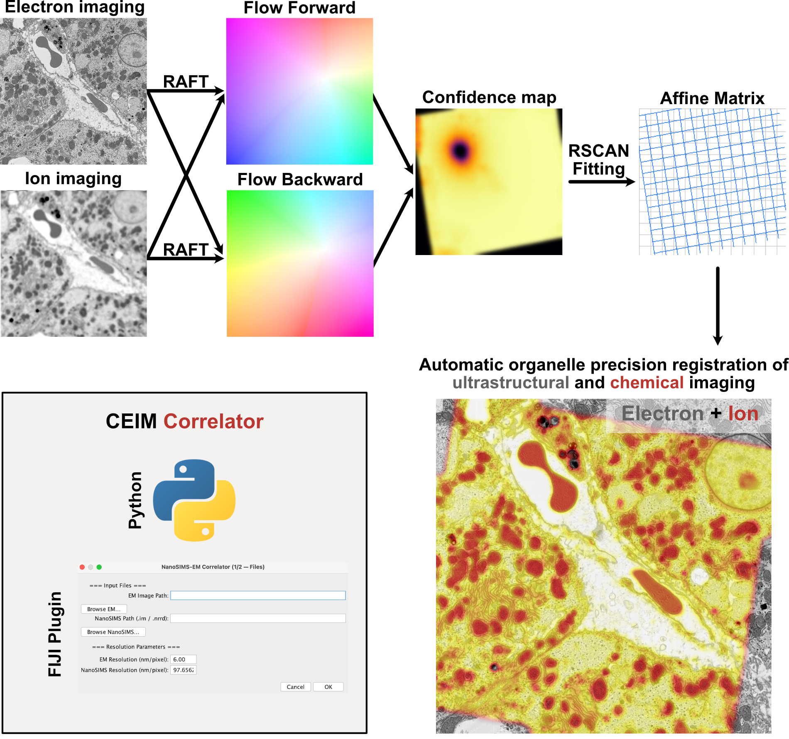
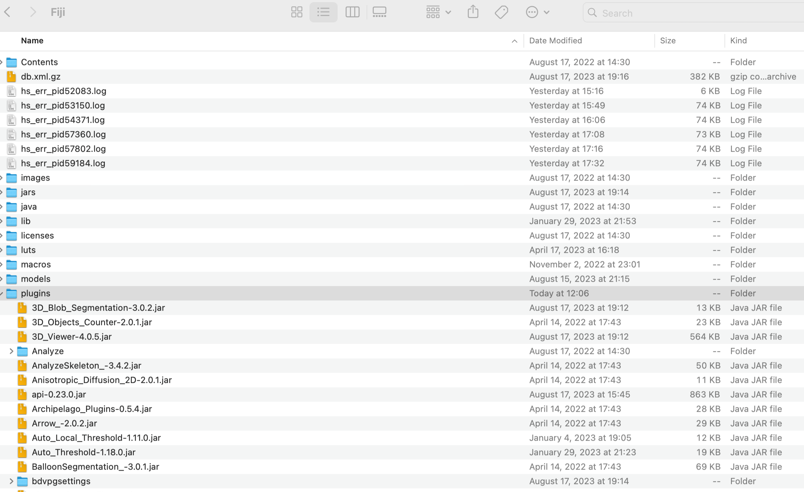
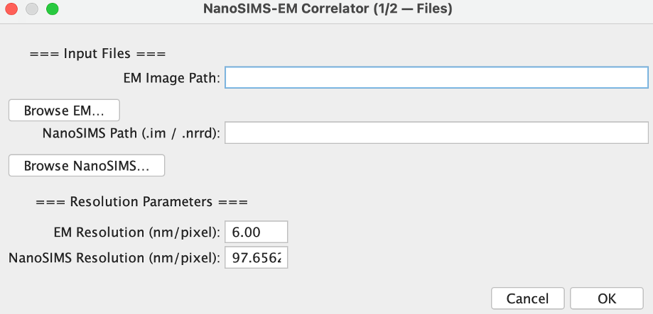
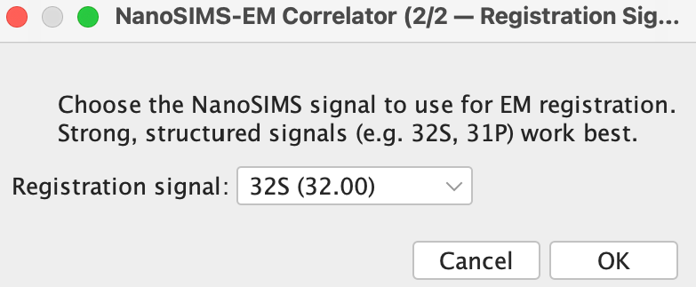

## NanoSIMS EM Correlator FIJI plugin manual

This repository contains the source code for our NanoSIMS EM Correlator ImageJ plugin. 

### Install Plugin

Please note that we don't support macOS before 11.  

1. Download the plugin jar files through the [link](https://zenodo.org/records/19303488) according to your system (Linux, macOS, Windows). 
3. move all the jar files into the Fiji plugins folder and restart the ImageJ finish the installation.

### Run Correction

1. Click plugin -> NanoSIMS Correlatve -> NanoSIMS EM Correlator

2. Browse the NanoSIMS and EM image. Input the pixel size of these two images.

   

3. Choose the channel that will be used to estimate the transformation matrix. 

    

4. Press ok and the alignment was done. The aligned nanoSIMS will be saved in the same folder as the raw NanoSIMS image. 